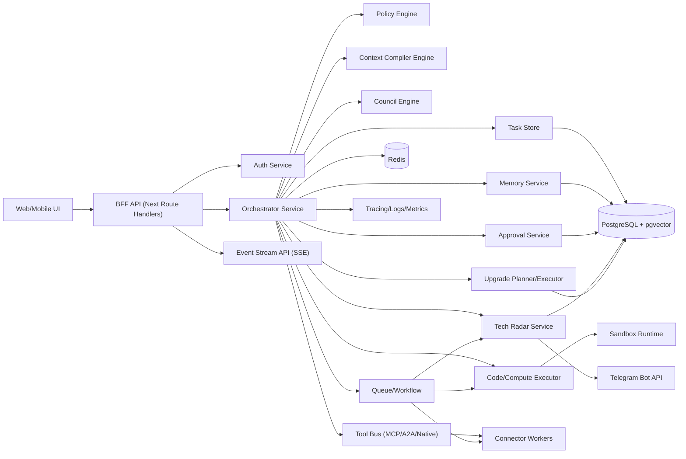

# Backend Architecture v1

문서 버전: v1.2  
작성일: 2026-02-22  
프로젝트: JARVIS Personal AI Operating System  
연결 문서:
`/Users/woody/ai/brain/docs/gemini-ui-design-brief.md`
`/Users/woody/ai/brain/docs/openapi-v1.yaml`
`/Users/woody/ai/brain/docs/db-schema-v1.sql`

## 1) 목표
이 백엔드는 다음 6가지를 동시에 만족해야 한다.

1. 실행형 비서: 일정/메일/문서/리서치/자동화 실행
2. 사고형 비서: 멀티에이전트 회의 + 결론 보고
3. 엔지니어링 비서: 코딩/테스트/디버깅
4. 계산 비서: 복잡 연산/시뮬레이션/검증
5. 운영형 비서: 장기 작업, 재시도, 체크포인트 복구
6. 진화형 비서: 최신 스택 레이더 수집/평가/보고 + 승인 기반 자동 개선

## 2) 아키텍처 원칙
1. 기본은 `Single Orchestrator`, 필요 시 `Dynamic Council` 승격
2. 병렬 실행이 기본값이다: 독립 스텝은 DAG 기반으로 동시 실행
3. 컨텍스트는 무한 확장이 아니라 `컴파일/요약/캐시/리콜`로 최적화
4. 작업별 메모리 정책(chat/council/code/compute)을 분리한다
5. 고위험 액션은 항상 `Approval Gate`를 거친다
6. 모든 결과는 근거(출처/로그/실행결과/재현정보)와 함께 제공
7. 쓰기 액션은 `idempotency` 보장
8. 장기 작업은 `durable execution`으로 중단/재개 가능
9. 보안 기본값은 최소권한 + 기본 거부(deny by default)
10. 자동 개선은 사용자 명시 명령(`작업 시작`) 이후에만 실행

## 3) 시스템 개요


## 4) 서비스 경계

### 4.1 BFF API
역할:
1. 세션 기반 인증 확인
2. 클라이언트 요청 정규화
3. SSE 스트림 중계
4. 레이트리밋/입력 검증 1차 게이트

기술:
1. Next.js Route Handlers
2. zod 스키마 검증
3. httpOnly secure cookie

### 4.2 Orchestrator Service
역할:
1. 요청 분류(Think)
2. 단일/회의 모드 전환(Debate)
3. 실행 플랜 생성 및 스텝 실행(Do)
4. 검증/결론 패키징(Verify/Report)

기술:
1. Node.js + Fastify
2. Durable workflow engine (권장: Temporal, 대안: BullMQ + checkpoint table)
3. OpenTelemetry tracing

### 4.3 Context Compiler Engine
역할:
1. 요청별 컨텍스트 예산 계산
2. 대화/로그/문서를 계층 요약으로 압축
3. task type별 context policy 적용
4. 근거 우선 컨텍스트 재조합

레이어:
1. hot context: Redis
2. warm context: Postgres summary chunks
3. cold context: object storage + vector recall

### 4.4 Council Engine
역할:
1. Planner/Researcher/Critic/Risk/Synthesizer 역할 실행
2. 라운드 제한(최대 3), 종료 조건 강제
3. 합의안/비합의안 구조화

### 4.5 Tool Bus + Connector Workers
역할:
1. 외부 시스템(Calendar/Mail/Notion/Files/Browser) 액세스
2. MCP/A2A/직접 SDK 어댑터 통합
3. 읽기/쓰기 권한 분리

### 4.6 Code/Compute Executor
역할:
1. 코드 실행, 테스트/린트/빌드
2. 연산/시뮬레이션 실행
3. 결과 재현 메타데이터 저장

보안:
1. sandbox runtime에서만 실행
2. 네트워크/파일시스템 권한 제한
3. 시간/메모리/출력 토큰 제한

### 4.7 Approval Service
역할:
1. 고위험 액션 승인 요청 생성
2. 승인/거절/만료 처리
3. 승인 토큰 발행 및 실행 시 검증

### 4.8 Memory Service
역할:
1. short-term memory 저장
2. long-term preference/fact memory 저장
3. 검색/TTL/삭제 정책 적용

작업별 메모리 최적화:
1. `chat`: 최신 대화 + 압축 히스토리
2. `council`: 주장/반론/근거 그래프
3. `code`: repo snapshot + test failures + patch chain
4. `compute`: 입력 파라미터 + 가정 + 검증 로그

### 4.9 Tech Radar Service
역할:
1. 최신 스택 소스 주기 수집
2. 기술 후보 정규화 + 중복 제거
3. 도입 점수 산정(효익/리스크/비용)
4. 주간 Telegram 리포트 생성

주기:
1. daily ingest
2. weekly recommendation digest
3. monthly deep review

### 4.10 Upgrade Planner/Executor
역할:
1. Tech Radar 제안을 실제 변경안으로 변환
2. 사용자 명령(`작업 시작`) 수신 시 자동 개선 실행
3. 브랜치 생성 -> 변경 적용 -> 테스트 -> 카나리 -> 결과 보고

보호 규칙:
1. 명시 승인 없는 prod 반영 금지
2. 실패 시 자동 롤백 + 원인 보고
3. 변경 전후 성능 비교 첨부 필수

## 5) 도메인 모델
권장 테이블:

1. `users`
2. `sessions`
3. `tasks`
4. `task_steps`
5. `task_events`
6. `approvals`
7. `tool_calls`
8. `artifacts`
9. `memory_facts`
10. `memory_preferences`
11. `memory_segments`
12. `context_snapshots`
13. `connector_accounts`
14. `tech_radar_items`
15. `tech_radar_scores`
16. `upgrade_proposals`
17. `upgrade_runs`
18. `telegram_reports`
19. `audit_logs`
20. `eval_runs`

핵심 키:
1. 모든 write API: `idempotency_key`
2. task/event: `trace_id`, `span_id`
3. code/compute: `execution_env_hash`, `input_hash`, `output_hash`
4. radar item: `source_url`, `published_at`, `confidence_score`
5. upgrade run: `baseline_metrics`, `post_metrics`, `rollback_ref`

## 6) 상태 머신

### 6.1 Task 상태
`queued -> running -> done`
`running -> blocked -> running`
`running -> retrying -> running`
`running -> failed`
`blocked -> approval_pending -> running|failed`

### 6.2 요청 모드 분류
1. `chat`
2. `execute`
3. `council`
4. `code`
5. `compute`
6. `long_run`
7. `high_risk`
8. `radar_review`
9. `upgrade_execution`

### 6.3 동적 Council 승격 기준
점수식(초기안):
`S = 0.35*complexity + 0.25*risk + 0.20*uncertainty + 0.20*cross_domain`

1. `S < 0.55`: Single Orchestrator
2. `0.55 <= S < 0.75`: Single + 강화검증
3. `S >= 0.75`: Council 모드

### 6.4 Upgrade 상태
`proposed -> approved -> planning -> running -> verifying -> deployed`
`running -> failed -> rolled_back`
`verifying -> rejected`

## 7) API 설계 (REST v1)
기본 원칙:
1. URL 버전 고정: `/api/v1/*`
2. 자원 중심 네이밍
3. 모든 요청/응답에 `request_id`
4. 오류 포맷 통일

### 7.1 현재 구현된 엔드포인트 (2026-02-23 기준)
Core:
1. `GET /health`

AI:
1. `GET /api/v1/providers`
2. `POST /api/v1/ai/respond`

Tasks:
1. `POST /api/v1/tasks`
2. `GET /api/v1/tasks`
3. `GET /api/v1/tasks/{taskId}`
4. `GET /api/v1/tasks/{taskId}/events` (SSE)

Tech Radar:
1. `POST /api/v1/radar/ingest`
2. `GET /api/v1/radar/items`
3. `POST /api/v1/radar/evaluate`
4. `GET /api/v1/radar/recommendations`
5. `POST /api/v1/radar/reports/telegram`

Upgrade Orchestration:
1. `GET /api/v1/upgrades/proposals`
2. `POST /api/v1/upgrades/proposals/{proposalId}/approve`
3. `POST /api/v1/upgrades/runs` (사용자 명령: `작업 시작`)
4. `GET /api/v1/upgrades/runs/{runId}`

Integrations:
1. `POST /api/v1/integrations/openai/webhook`
2. `POST /api/v1/integrations/telegram/webhook`

### 7.2 후속 구현 예정 엔드포인트 (백로그)
1. `POST /api/v1/tasks/{taskId}/cancel`
2. `POST /api/v1/tasks/{taskId}/retry`
3. `GET /api/v1/tasks/{taskId}/artifacts`
4. `POST /api/v1/upgrades/runs/{runId}/rollback`
5. Council/Reports API (`/api/v1/councils`, `/api/v1/reports`)
6. Code/Compute 실행 API (`/api/v1/executions/*`)
7. Memory/Connectors API (`/api/v1/memory/*`, `/api/v1/connectors/*`)

## 8) API 응답 표준

### 8.1 성공
```json
{
  "request_id": "req_...",
  "data": {},
  "meta": {}
}
```

### 8.2 실패
```json
{
  "request_id": "req_...",
  "error": {
    "code": "VALIDATION_ERROR",
    "message": "invalid payload",
    "details": []
  }
}
```

### 8.3 공통 HTTP 코드
1. `200` 성공
2. `201` 생성
3. `202` 비동기 수락
4. `400` 잘못된 요청
5. `401` 인증 실패
6. `403` 권한 없음
7. `404` 없음
8. `409` 상태 충돌
9. `422` 검증 실패
10. `429` 레이트 제한
11. `500` 내부 오류

## 9) 이벤트 계약 (SSE)
`event:` 타입:
1. `task.created`
2. `task.step.started`
3. `task.step.completed`
4. `task.blocked.approval`
5. `task.retry.scheduled`
6. `task.completed`
7. `task.failed`
8. `report.ready`
9. `radar.digest.ready`
10. `upgrade.run.started`
11. `upgrade.run.completed`
12. `upgrade.run.failed`

payload 예시:
```json
{
  "event_id": "evt_...",
  "task_id": "task_...",
  "type": "task.step.completed",
  "timestamp": "2026-02-22T10:00:00Z",
  "data": {
    "step": "tool_call",
    "status": "done",
    "latency_ms": 842
  }
}
```

## 10) 보안 설계

### 10.1 인증/세션
1. OIDC 기반 로그인
2. httpOnly + secure + sameSite cookie
3. 세션 만료 및 회전

### 10.2 인가
1. RBAC + ABAC 혼합
2. 승인 토큰 없는 고위험 쓰기 차단
3. connector scope 최소권한

### 10.3 입력/출력 보호
1. 모든 API는 zod 검증
2. SQL은 파라미터 바인딩만 허용
3. 프롬프트 인젝션 필터 + tool allowlist
4. 민감정보 마스킹(로그/리포트)

### 10.4 실행 샌드박스
1. 코드/연산은 격리 런타임(컨테이너/마이크로VM) 실행
2. 기본 outbound deny, 필요 도메인 allowlist
3. CPU/메모리/시간 quota
4. 파일 접근 제한(작업 디렉터리 scoped)

### 10.5 Telegram 보고 보안
1. bot token은 secret manager 저장
2. 보고 대상 chat_id allowlist
3. webhook `secret_token` 헤더 검증 + `update_id` replay 방지
4. 위험 명령(`작업 시작`, `롤백`)은 2단계 확인
5. 텔레그램 입력은 전부 audit log 저장

### 10.6 감사
1. 모든 승인/쓰기 이벤트 audit log 저장
2. 누가/언제/무엇/왜/근거 필수
3. append-only 정책

## 11) 성능/신뢰성 SLO
1. 일반 질의 p95 첫 응답 < 2.5s
2. 단일 도구 작업 p95 < 12s
3. 장기 작업 성공률 >= 92%
4. 승인 필요 액션 오실행률 0%
5. 이벤트 스트림 지연 p95 < 800ms
6. 병렬 실행 효율: 독립 스텝 평균 실행시간 35% 이상 단축
7. 컨텍스트 토큰 절감: 동등 품질 기준 40% 이상 절감
8. 기술 레이더 보고 누락률 0%

### 11.1 지표 계산식
1. 병렬 실행 효율(%):
   `((sequential_ms - parallel_ms) / sequential_ms) * 100`
2. 토큰 절감률(%):
   `((baseline_tokens - optimized_tokens) / baseline_tokens) * 100`
3. 레이더 보고 누락률(%):
   `((expected_reports - delivered_reports) / expected_reports) * 100`
4. 모든 비율 값은 0~100 범위로 clamp 한다.

## 12) 인프라 구성
1. App: Next.js (UI+BFF)
2. Core: Fastify Orchestrator
3. Queue/Workflow: Temporal(권장) 또는 BullMQ
4. DB: PostgreSQL + pgvector
5. Cache/Rate Limit: Redis
6. Storage: S3 호환 오브젝트 스토리지
7. Telemetry: OpenTelemetry + central log + metrics backend
8. Scheduler: cron + queue worker (daily/weekly/monthly radar)
9. Telegram: bot gateway service

## 13) 배포 전략
환경:
1. `dev`: 단일 클러스터, 축소 리소스
2. `staging`: prod 동형, 테스트 데이터
3. `prod`: 멀티 AZ, 백업/복구 자동화

배포:
1. blue/green 또는 canary
2. schema migration은 backward compatible 우선
3. feature flag로 Council/Code/Compute/Radar/Upgrade 점진 활성화

## 14) 구현 로드맵 (12주)
1. 1-2주: Task API + SSE + Approval 최소기능
2. 3-4주: Connector 2종 + durable workflow + checkpoint
3. 5-6주: Council Engine + Reasoning Report
4. 7주: Code/Compute sandbox + repro metadata
5. 8-9주: Context Compiler + 작업별 memory optimization
6. 10주: Tech Radar ingest + scoring + Telegram digest
7. 11주: Upgrade Planner/Executor + `작업 시작` 명령 연동
8. 12주: 보안강화 + 관측/평가 + 성능 튜닝

## 15) 기술 레이더 운영 규칙
1. 소스 카테고리:
   모델/에이전트 표준/프레임워크/DB/인프라/보안
2. 점수 축(0-5):
   성능 개선, 신뢰성 개선, 도입 난이도, 롤백 난이도, 보안 리스크
3. 도입 조건:
   총점 + 가중치 기준 통과 + 샌드박스 성능 실험 통과
4. 보고 주기:
   매주 Telegram 요약 + 월간 상세 리포트
5. 보고 포맷:
   후보 기술 / 기대 이득 / 마이그레이션 비용 / 권장 결정(도입/보류/폐기)

### 15.1 운영 패치 자동제안 규칙
1. Node.js:
   `preferred_major`보다 낮으면 `node_lts_upgrade` 제안을 자동 생성한다.
2. PostgreSQL:
   최신 minor보다 낮으면 `postgres_minor_patch`를 자동 생성한다.
   out-of-cycle 보안 공지 시 `postgres_security_notice`를 critical로 생성한다.
3. Valkey:
   최신 patch보다 낮으면 `valkey_patch_update`를 자동 생성한다.
   취약점 공지 시 `valkey_security_notice`를 high로 생성한다.
4. 심각도별 Telegram 경보:
   critical 즉시, high 24시간 이내, medium 주간 다이제스트로 보고한다.

## 16) 오픈 이슈
1. Workflow 엔진을 Temporal로 고정할지 BullMQ로 시작할지
2. Code/Compute sandbox를 자체 운영할지 managed 서비스 사용할지
3. Memory retention 기간 기본값 및 사용자 제어 정책
4. Council 승격 점수식 실측 기반 튜닝 계획
5. Telegram 명령 승인 플로우(웹 승인 병행 vs Telegram 2FA)
6. 자동 개선 범위(코드만 vs 인프라 포함) 상한선 정의

## 17) 2026-02 권장 스택 업데이트
아래는 2026-02 기준 공식 문서로 확인한 우선 권장 스택이다.

1. Model API:
   `Responses API`를 기본으로 사용하고 `parallel_tool_calls=true`를 활용한다.
2. Long-running execution:
   장기 작업은 `background=true` + polling/stream 재개를 기본 경로로 사용한다.
3. Context optimization:
   Prompt Caching은 기본 활성 + 고정 prefix 설계.
   장기 세션은 `prompt_cache_retention=24h`를 선택적으로 사용한다.
4. Conversation state:
   `Conversations API` 또는 `previous_response_id` 체인을 기본 사용하고,
   데이터 정책에 따라 `store`를 제어한다.
5. Tool interop:
   `MCP (2025-11-25)` + `A2A (0.3.x)` 조합으로 표준화한다.
6. Database:
   `PostgreSQL 18.x` + `pgvector 0.8.1`을 기본 조합으로 사용한다.
7. Cache/Queue backing:
   Redis 대체/호환이 필요하면 `Valkey 9.0.x`를 기본 후보로 둔다.
8. Durable workflow:
   오케스트레이션 신뢰성이 최우선이면 `Temporal`을 1순위로 사용한다.
9. Observability:
   OpenTelemetry는 최신 semconv 릴리스 추적(안정성 레벨 반영) 정책을 둔다.
10. External control channel:
   Telegram webhook은 `secret_token` 검증 헤더를 강제한다.

## 18) 기술 레이더 수집 소스 (공식 우선)
레이더 수집기는 아래 소스를 우선 수집한다.

1. OpenAI:
   API docs guides/reference/changelog, product announcements
2. MCP:
   modelcontextprotocol.io specification + changelog + sdk tiering
3. A2A:
   a2a-protocol.org spec + a2aproject/A2A GitHub releases
4. Anthropic:
   platform.claude.com docs, context management announcements
5. Database:
   postgresql.org release/versioning, pgvector GitHub releases
6. Cache:
   valkey.io release pages + valkey GitHub releases
7. Durable orchestration:
   temporal.io docs/changelog
8. Telemetry:
   opentelemetry.io changelog/spec updates
9. Notification channel:
   core.telegram.org/bots/api

수집 규칙:
1. 비공식 블로그/요약 사이트는 참고만 하고, 의사결정 점수에는 반영하지 않는다.
2. 각 기술 후보는 최소 2개 공식 근거가 있어야 도입 후보로 승격한다.
3. 보안/정책/라이선스 변경은 성능 개선보다 우선 경보한다.

## 19) 도입 의사결정 게이트
기술 레이더에서 “도입”으로 결정되려면 아래를 통과해야 한다.

1. 기능 적합성:
   현재 로드맵 요구사항과 직접 연결되어야 한다.
2. 성능 검증:
   샌드박스 PoC에서 기존 대비 유의미 개선(예: 20%+)이 있어야 한다.
3. 안정성 검증:
   실패/재시도/복구 테스트를 통과해야 한다.
4. 보안 검증:
   secrets, 권한 모델, 데이터 경계, 감사로그 요구사항을 통과해야 한다.
5. 롤백 가능성:
   실패 시 1-click 또는 단일 워크플로우로 복구 가능해야 한다.
6. 사용자 승인:
   자동 개선 작업은 반드시 `작업 시작` 명령 이후 실행한다.

## 20) 2026-02 재검토 추가 권고
아래 항목은 2026-02 공식 업데이트 반영 기준으로 즉시 추가 권장한다.

1. API 수명주기:
   신규 개발은 `Responses API` 중심으로 고정한다.
   `Assistants API`는 사용 중단 마이그레이션 트랙으로 분리한다.
2. 컨텍스트 수명주기:
   장기 대화는 `responses/compact`를 주기적으로 호출해 토큰 비용을 제어한다.
3. 비동기 완료 처리:
   `background=true` 작업은 polling/SSE 외에 webhook 수신 경로를 기본 제공한다.
   webhook은 서명 검증 실패 시 즉시 폐기한다.
4. 품질 게이트:
   업그레이드 실행 전 `Evals + Trace grader`를 필수 게이트로 둔다.
   프롬프트 변경은 Prompt Optimizer 결과와 함께 비교 평가한다.
5. 표준 프로토콜 적합성:
   MCP는 Streamable HTTP 전환을 기본으로 하고 `Origin` 검증을 강제한다.
   A2A 연동은 TCK(호환성 테스트) 통과를 배포 조건으로 둔다.
6. 런타임 기준선:
   서버 런타임은 `Node.js v24 Active LTS`를 기본값으로 사용한다.
   하위 호환 운영이 필요하면 `v22 Maintenance LTS`만 허용한다.
7. 운영 패치 정책:
   `PostgreSQL 18.x` minor 릴리스를 월간 반영하고 out-of-cycle 보안 공지는 즉시 검토한다.
   `Valkey 9.x`는 patch 릴리스 단위로 추적하고 취약점 공지는 24시간 내 대응 여부를 결정한다.
8. 스펙 추적 자동화:
   기술 레이더는 OpenAI/MCP/A2A/PostgreSQL/Valkey/Telegram changelog diff를 일일 수집한다.
   월간 리포트에는 “도입/보류”뿐 아니라 “폐기/마이그레이션 필요” 상태를 포함한다.
