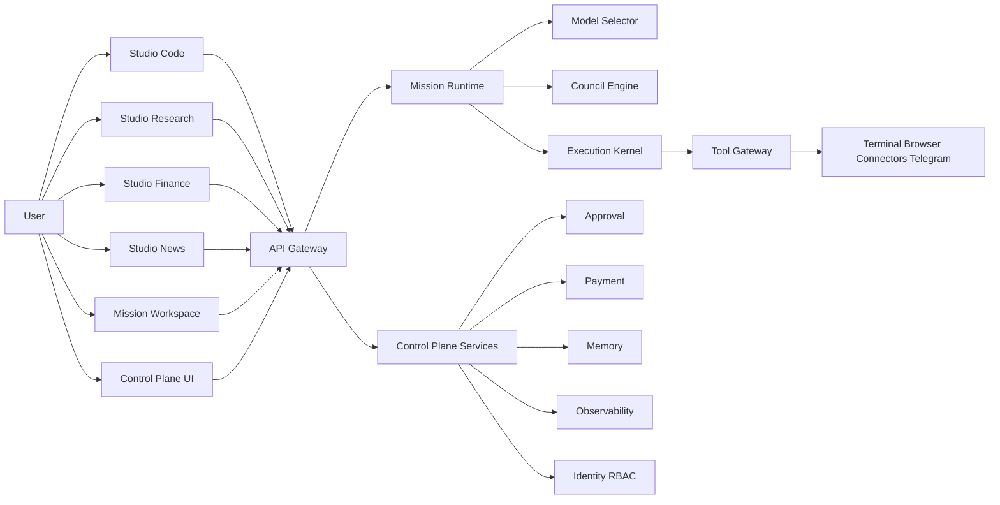

# JARVIS Refactor Architecture v3

문서 버전: v3.0  
작성일: 2026-02-24  
프로젝트: JARVIS Personal AI Operating System

---

## 1) 목적

이 문서는 현재 코드베이스 구조를 기준으로, 다음 리팩토링 목표를 현실적으로 달성하기 위한 설계안이다.

1. UX 분리: 코드/리서치/금융/뉴스는 전용 Studio 화면으로 분리
2. 엔진 통합: 실행 엔진은 `Mission Runtime`으로 단일화
3. 통제 분리: 승인/결제/보안/정책은 `Control Plane`으로 독립
4. 점진 전환: 기존 HUD/패널 구조를 깨지 않고 단계적으로 이관

---

## 2) 현재 프로젝트 구조 진단

### 2.1 레포 구성

1. `backend`: Fastify 기반 API, provider router, council/execution/task/radar/upgrade
2. `web`: Next.js App Router 기반 HUD UI, 모듈형 패널 시스템, 인증 페이지
3. `docs`: 아키텍처/스키마/OpenAPI/기존 플랜 문서

### 2.2 백엔드 현재 상태

주요 구성:

1. 인증/세션/권한
- `/api/v1/auth/signup`, `/api/v1/auth/login`, `/api/v1/auth/logout`
- role: `member | operator | admin`

2. AI 라우팅
- `/api/v1/ai/respond`
- `ProviderRouter`가 `provider=auto` 시 점수 기반 정렬 수행

3. 비동기 실행
- `/api/v1/councils/runs`
- `/api/v1/executions/runs`
- `/api/v1/tasks`

4. 운영/관리
- `/api/v1/reports/overview`
- provider key 관리 및 테스트 API
- telegram webhook/upgrade 승인 연동

### 2.3 프론트엔드 현재 상태

주요 구성:

1. HUD 중심 단일 화면
- `/`에서 widget 토글 방식(`inbox`, `assistant`, `workbench`, `tasks`, `council`, `approvals`, `memory`, `settings`)

2. 인증 페이지
- `/login`, `/signup` (3D Core 렌더 포함)

3. 라우팅 보호
- `proxy.ts`에서 인증 쿠키 기반 접근 제어

4. 운영 UI
- settings에서 provider API key 등록/삭제/연결 테스트 가능

### 2.4 현재 강점

1. 엔드투엔드 기본 동선은 이미 동작
2. provider 모델 카탈로그 조회/테스트까지 구현
3. approval 및 telegram 기본 callback 흐름 존재
4. 3D 시각 코어는 상태 신호 기반으로 동작

### 2.5 현재 한계

1. UX가 HUD 패널 중심으로 과집중되어 도메인별 작업 깊이가 부족
2. Council이 "실제 다중 에이전트 라운드 엔진"으로 완전히 분리되지 않음
3. 개인화 메모리/목표 플래너가 스냅샷 수준에 머무름
4. 시뮬레이션 우선 실행/리스크 기반 정책 엔진이 미완성
5. 결제/구매 워크플로우 도메인이 부재
6. 멀티세션 워크스페이스 분리 미구현

---

## 3) 리팩토링 원칙

1. 사용자 화면은 분리하고, 실행 커널은 공통화한다.
2. 리스크가 큰 기능은 Studio에서 직접 실행하지 않고 Control Plane으로 위임한다.
3. 기존 API를 최대한 유지하고, 신규 API를 병렬로 추가한다.
4. 모든 고위험 액션은 `simulate -> approve -> execute`를 강제한다.
5. 선택 이유, 실행 이력, 감사로그를 UI에서 항상 추적 가능하게 만든다.

---

## 4) 목표 구조 (To-Be)

---

## 5) 기능 경계 재정의

### 5.1 Mission Runtime에 포함

1. 코드 작성/설계 보조
2. 리서치/분석/요약
3. 금융 분석
4. 뉴스 브리핑 생성
5. 상품 후보 탐색/비교/추천
6. 모델 자동 선택 및 fallback
7. Council 토론/합성

### 5.2 Control Plane으로 분리

1. 인증/세션/RBAC
2. provider key 및 connector credential 관리
3. 승인 센터(만료/재승인 포함)
4. 결제 실행/주문 상태/영수증
5. 메모리 수정/삭제/보존정책
6. 세션/워크스페이스 관리
7. 감사로그/운영 대시보드/정책 관리

핵심 경계:

1. Mission은 결제 실행 금지, `payment_draft`까지만 생성
2. Mission의 high risk 액션은 approval token 없으면 실행 금지
3. 승인 완료 이벤트를 Mission Run으로 콜백해 재개

---

## 6) UX/라우팅 설계

신규 상위 라우트:

1. `/studio/code`
2. `/studio/research`
3. `/studio/finance`
4. `/studio/news`
5. `/mission`
6. `/approvals`
7. `/payments`
8. `/memory`
9. `/sessions`
10. `/settings`
11. `/reports`
12. `/admin`

라우팅 규칙:

1. 단일 도메인 요청은 해당 studio로 라우팅
2. 복합 요청은 `/mission`으로 라우팅
3. mission step이 code/research/finance/news로 분기되면 해당 studio deep-link로 이동

---

## 7) 오케스트레이터 설계

`provider=auto` 점수식:

`score = w1*domain_fit + w2*recent_success + w3*(1-latency_norm) + w4*(1-cost_norm) + w5*context_fit - penalties`

필수 동작:

1. 하드 필터: 키 없음/정책 위반/컨텍스트 초과 제외
2. top-1 실행, 실패 시 재점수화하여 top-N 재선택
3. 응답에 선택 근거 포함:
- strategy
- ordered candidates
- score breakdown
- fallback history

---

## 8) 데이터 모델 확장

신규 권장 테이블:

1. `workspaces`
2. `missions`
3. `mission_steps`
4. `model_decisions`
5. `capability_packs`
6. `pack_versions`
7. `policy_profiles`
8. `approval_rules`
9. `tool_runs`
10. `payment_orders`
11. `payment_transactions`
12. `audit_events`

기존 테이블과 연결:

1. `tasks`는 mission step 실행 단위로 재사용
2. `upgrade_proposals`/`upgrade_runs`는 approval/policy 패턴의 초기 구현으로 유지

---

## 9) API 리팩토링 방향

신규 API 군:

1. `POST /api/v1/missions`
2. `GET /api/v1/missions/:id`
3. `GET /api/v1/missions/:id/events`
4. `POST /api/v1/missions/:id/steps/:stepId/execute`
5. `POST /api/v1/approvals/:id/decision`
6. `POST /api/v1/payments/orders`
7. `POST /api/v1/payments/orders/:id/confirm`
8. `GET /api/v1/workspaces`
9. `POST /api/v1/workspaces`

호환성 원칙:

1. 기존 `/api/v1/ai/respond`, `/api/v1/councils/runs`, `/api/v1/executions/runs`는 즉시 제거하지 않음
2. mission API를 추가하고 내부에서 기존 엔진을 호출하도록 어댑트
3. UI가 점진적으로 mission API로 이관된 뒤 레거시 축소

---

## 10) 보안/안정성 필수 정책

1. secrets는 저장 시 암호화 + 런타임 복호화만 허용
2. 시뮬레이션 기본값 강제
3. approval callback은 서명/만료/nonce/idempotency 검증
4. terminal/browser 툴은 격리 런타임에서 실행
5. 모든 실행은 trace id와 audit event 남김

---

## 11) 단계별 리팩토링 전략

### Phase 1. 라우팅/UX 분리 (저위험)

1. studio/mission 라우트 신설
2. 기존 HUD는 유지
3. deep-link로 단계적 이동

### Phase 2. Mission Runtime 도입

1. mission entity + mission step 추가
2. orchestration kernel 표준 단계 도입
3. 기존 ai/council/execution API를 mission step adapter로 연결

### Phase 3. Control Plane 분리 강화

1. approvals/payments/sessions/memory policy 전용 API
2. admin 정책 편집 UI
3. telegram 승인 콜백 강화

### Phase 4. 고도화

1. dynamic council role template
2. observability 대시보드 고도화
3. self-review 기반 개선 제안 자동화

---

## 12) 완료 기준

1. 도메인별 Studio 화면이 독립적으로 동작
2. mission run이 단일 엔드포인트에서 생성/추적 가능
3. high risk 액션은 승인 없이 실행되지 않음
4. provider auto 선택 근거가 UI에 노출됨
5. 기존 기능 회귀 없이 점진 이행 가능

