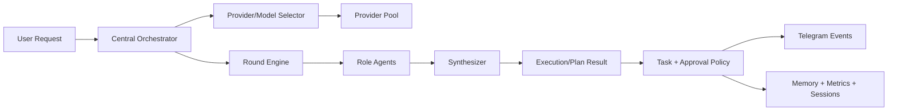

# JARVIS Orchestrator + Multi-Agent Platform V2 Implementation Plan

> **For Claude:** REQUIRED SUB-SKILL: Use superpowers:executing-plans to implement this plan task-by-task.

**Goal:** `/tasks`를 HUD 패널 UX로 통일하고, `provider=auto`를 고정 우선순위 라우팅에서 중앙 오케스트레이터 판단으로 전환하며, 실시간 다중 라운드 토론 엔진과 운영 기능(텔레그램 알림, 메모리, 플래너, 시뮬레이션, 승인, 대시보드, 멀티세션, 자가개선 루프)을 제품 수준으로 구현한다.

**Architecture:** 백엔드에 `Central Orchestrator`(모델선정 정책+토론 라운드 스케줄러+실행 정책 엔진)를 도입하고, 프론트는 HUD 패널 기반 멀티세션 워크스페이스로 통합한다. 토론은 단일 모델 응답 재포장 방식이 아니라, 역할별 에이전트가 라운드 상태를 공유하며 반박/보강을 반복하고, 최종 합성 에이전트가 결론을 생성한다. 운영 알림은 통합 액션 커넥터 범위를 Telegram으로 제한하고 임무 진행/완료/승인 요청 이벤트만 발행한다.

**Tech Stack:** Next.js App Router, Fastify, TypeScript, PostgreSQL, SSE, Zod, Vitest, Telegram Bot API, (선택) BullMQ/Temporal, OpenTelemetry

---

## Blueprint Scope

- `provider=auto` 선택 시: 고정 순서 fallback 제거, 중앙 모델 선택기로 provider/model 결정
- 실시간 다중 라운드 토론: 역할별 에이전트 + 라운드 상태 머신 + 스트리밍 UI
- Telegram 액션 커넥터 범위: `진행`, `완료`, `승인 요청` 알림
- 개인화 메모리, 목표 기반 플래너, 실행 전 시뮬레이션, 사람 승인 워크플로우, 관측성 대시보드, 멀티세션 작업공간, 자가개선 루프

## System Flow (V2)



### Task 1: `/tasks` 패널 일원화 + 딥링크 규약

**Files:**
- Modify: `/Users/woody/ai/brain/web/src/app/page.tsx`
- Modify: `/Users/woody/ai/brain/web/src/app/tasks/page.tsx`
- Modify: `/Users/woody/ai/brain/web/src/app/tasks/[id]/page.tsx`
- Test: `/Users/woody/ai/brain/web`

**Step 1: failing behavior 확인**
Run: `cd /Users/woody/ai/brain/web && npm run build`
Expected: `/tasks`가 독립 페이지로 렌더됨(패널 일관성 미충족)

**Step 2: 최소 구현**
- `/tasks`를 `/?widget=tasks`로 리다이렉트
- HUD 루트에서 `widget/widgets` 쿼리 파라미터를 읽어 패널 자동 오픈
- Task detail back 링크도 패널 딥링크로 정렬

**Step 3: 검증**
Run: `cd /Users/woody/ai/brain/web && npm run lint && npm run build`
Expected: PASS

**Step 4: 수동 확인**
- `/tasks` 진입 시 HUD에서 `tasks` 패널이 열린 상태인지 확인
- `/tasks/[id]`에서 Back 시 `tasks` 패널 복귀 확인

**Step 5: Commit**
```bash
git add /Users/woody/ai/brain/web/src/app/page.tsx /Users/woody/ai/brain/web/src/app/tasks/page.tsx /Users/woody/ai/brain/web/src/app/tasks/[id]/page.tsx
git commit -m "feat: route tasks page into HUD panel deep-link"
```

### Task 2: Central Orchestrator 모델 선택기 도입 (`auto` 리팩토링 핵심)

**Files:**
- Create: `/Users/woody/ai/brain/backend/src/orchestrator/model-selector.ts`
- Create: `/Users/woody/ai/brain/backend/src/orchestrator/selector-policy.ts`
- Modify: `/Users/woody/ai/brain/backend/src/providers/router.ts`
- Modify: `/Users/woody/ai/brain/backend/src/routes/index.ts`
- Create: `/Users/woody/ai/brain/backend/src/orchestrator/__tests__/model-selector.test.ts`
- Modify: `/Users/woody/ai/brain/docs/openapi-v1.yaml`

**Step 1: failing test 작성**
- `provider=auto`에서 task_type, latency, cost, failure history를 기반으로 provider/model을 선택하는지 검증
- 고정 순서 회귀(기존 DEFAULT_ORDER 강제) 시 FAIL

**Step 2: 테스트 실행**
Run: `cd /Users/woody/ai/brain/backend && pnpm vitest src/orchestrator/__tests__/model-selector.test.ts`
Expected: FAIL

**Step 3: 최소 구현**
- `ModelSelector`가 scoring 기반으로 후보를 정렬
- `/ai/respond`는 `auto`일 때 selector 결과를 우선 적용
- 응답에 `selection_reason`, `selection_score`, `served_model` 메타 추가

**Step 4: 테스트 재실행**
Run: `cd /Users/woody/ai/brain/backend && pnpm vitest src/orchestrator/__tests__/model-selector.test.ts`
Expected: PASS

**Step 5: Commit**
```bash
git add /Users/woody/ai/brain/backend/src/orchestrator /Users/woody/ai/brain/backend/src/providers/router.ts /Users/woody/ai/brain/backend/src/routes/index.ts /Users/woody/ai/brain/docs/openapi-v1.yaml
git commit -m "feat: replace auto fixed-order routing with central model selector"
```

### Task 3: 실시간 다중 라운드 토론 엔진 (진짜 에이전트 라운드)

**Files:**
- Create: `/Users/woody/ai/brain/backend/src/council/round-engine.ts`
- Create: `/Users/woody/ai/brain/backend/src/council/agent-prompts.ts`
- Modify: `/Users/woody/ai/brain/backend/src/routes/index.ts`
- Modify: `/Users/woody/ai/brain/backend/src/store/types.ts`
- Modify: `/Users/woody/ai/brain/backend/src/store/postgres-store.ts`
- Create: `/Users/woody/ai/brain/backend/src/council/__tests__/round-engine.test.ts`

**Step 1: failing test 작성**
- planner/researcher/critic/risk가 각 라운드에서 이전 라운드 요약을 입력으로 받아 의견을 갱신하는지 테스트
- `max_rounds`까지 consensus 미도달 시 escalation 테스트

**Step 2: 테스트 실행**
Run: `cd /Users/woody/ai/brain/backend && pnpm vitest src/council/__tests__/round-engine.test.ts`
Expected: FAIL

**Step 3: 최소 구현**
- `queued -> running(round_n) -> completed|failed|escalated` 상태 머신 구현
- 라운드별 agent output, rebuttal, evidence를 저장
- SSE 이벤트 확장: `council.round.started`, `council.agent.responded`, `council.round.completed`, `council.consensus.updated`

**Step 4: 테스트 재실행**
Run: `cd /Users/woody/ai/brain/backend && pnpm vitest src/council/__tests__/round-engine.test.ts`
Expected: PASS

**Step 5: Commit**
```bash
git add /Users/woody/ai/brain/backend/src/council /Users/woody/ai/brain/backend/src/routes/index.ts /Users/woody/ai/brain/backend/src/store
git commit -m "feat: add real-time multi-round council engine with role agents"
```

### Task 4: Council/Assistant 프론트 스트리밍 UI 리팩토링

**Files:**
- Modify: `/Users/woody/ai/brain/web/src/components/modules/CouncilModule.tsx`
- Modify: `/Users/woody/ai/brain/web/src/components/modules/AssistantModule.tsx`
- Create: `/Users/woody/ai/brain/web/src/components/ui/RoundTimeline.tsx`
- Modify: `/Users/woody/ai/brain/web/src/lib/api/types.ts`
- Modify: `/Users/woody/ai/brain/web/src/lib/api/endpoints.ts`

**Step 1: failing UI test 작성**
- 라운드별 상태, agent별 발화, 반박 관계, 합성 결과가 실시간으로 갱신되는지 검증

**Step 2: 테스트 실행**
Run: `cd /Users/woody/ai/brain/web && npm run lint`
Expected: 신규 타입 누락으로 FAIL(초기)

**Step 3: 최소 구현**
- `RUN 섹션` + `ROUND 섹션` 이중 탐색 탭 구현
- `Requested vs Served Model`과 `selection_reason` 노출
- agent별 스트림 카드(발화 + confidence + citation)

**Step 4: 검증**
Run: `cd /Users/woody/ai/brain/web && npm run lint && npm run build`
Expected: PASS

**Step 5: Commit**
```bash
git add /Users/woody/ai/brain/web/src/components/modules /Users/woody/ai/brain/web/src/components/ui /Users/woody/ai/brain/web/src/lib/api
git commit -m "feat: add round-aware council and assistant streaming UI"
```

### Task 5: Telegram 통합 액션 커넥터 (진행/완료/승인요청 한정)

**Files:**
- Create: `/Users/woody/ai/brain/backend/src/integrations/telegram/event-dispatcher.ts`
- Modify: `/Users/woody/ai/brain/backend/src/integrations/telegram/commands.ts`
- Modify: `/Users/woody/ai/brain/backend/src/routes/index.ts`
- Create: `/Users/woody/ai/brain/backend/src/integrations/telegram/__tests__/event-dispatcher.test.ts`

**Step 1: failing test 작성**
- task 상태가 `running|done|approval_pending` 전환 시 telegram payload가 생성되는지 테스트

**Step 2: 테스트 실행**
Run: `cd /Users/woody/ai/brain/backend && pnpm vitest src/integrations/telegram/__tests__/event-dispatcher.test.ts`
Expected: FAIL

**Step 3: 최소 구현**
- 이벤트 타입 3종만 발행: `MISSION_PROGRESS`, `MISSION_COMPLETED`, `APPROVAL_REQUESTED`
- 민감정보 마스킹 + 재시도 큐(최대 재시도 횟수) 적용

**Step 4: 테스트 재실행**
Run: `cd /Users/woody/ai/brain/backend && pnpm vitest src/integrations/telegram/__tests__/event-dispatcher.test.ts`
Expected: PASS

**Step 5: Commit**
```bash
git add /Users/woody/ai/brain/backend/src/integrations/telegram /Users/woody/ai/brain/backend/src/routes/index.ts
git commit -m "feat: add telegram action connector for progress completion and approval events"
```

### Task 6: 개인화 메모리 서비스

**Files:**
- Create: `/Users/woody/ai/brain/backend/src/memory/profile-store.ts`
- Modify: `/Users/woody/ai/brain/backend/src/routes/index.ts`
- Modify: `/Users/woody/ai/brain/backend/db-schema-v1.sql`
- Create: `/Users/woody/ai/brain/backend/src/memory/__tests__/profile-store.test.ts`
- Modify: `/Users/woody/ai/brain/web/src/components/modules/MemoryModule.tsx`

**Step 1: failing test 작성**
- 사용자 선호(톤/속도/금지영역)가 저장/조회/버전관리 되는지 테스트

**Step 2: 테스트 실행**
Run: `cd /Users/woody/ai/brain/backend && pnpm vitest src/memory/__tests__/profile-store.test.ts`
Expected: FAIL

**Step 3: 최소 구현**
- `user_memory_profiles` + `memory_profile_events` 테이블 추가
- API: `GET/PUT /api/v1/memory/profile`
- Orchestrator 입력 프롬프트에 profile projection 주입

**Step 4: 테스트 재실행**
Run: `cd /Users/woody/ai/brain/backend && pnpm vitest src/memory/__tests__/profile-store.test.ts`
Expected: PASS

**Step 5: Commit**
```bash
git add /Users/woody/ai/brain/backend/src/memory /Users/woody/ai/brain/backend/src/routes/index.ts /Users/woody/ai/brain/backend/db-schema-v1.sql /Users/woody/ai/brain/web/src/components/modules/MemoryModule.tsx
git commit -m "feat: add personalized memory profile service"
```

### Task 7: 목표 기반 플래너

**Files:**
- Create: `/Users/woody/ai/brain/backend/src/planner/goal-planner.ts`
- Create: `/Users/woody/ai/brain/backend/src/planner/__tests__/goal-planner.test.ts`
- Modify: `/Users/woody/ai/brain/backend/src/routes/index.ts`
- Modify: `/Users/woody/ai/brain/web/src/components/modules/TasksModule.tsx`

**Step 1: failing test 작성**
- 목표 입력 시 milestone, dependency, priority를 포함한 실행계획 생성 테스트

**Step 2: 테스트 실행**
Run: `cd /Users/woody/ai/brain/backend && pnpm vitest src/planner/__tests__/goal-planner.test.ts`
Expected: FAIL

**Step 3: 최소 구현**
- API: `POST /api/v1/plans/generate`
- 출력: `phases`, `tasks`, `dependencies`, `approval_checkpoints`
- 생성된 plan을 task queue로 materialize 옵션 제공

**Step 4: 테스트 재실행**
Run: `cd /Users/woody/ai/brain/backend && pnpm vitest src/planner/__tests__/goal-planner.test.ts`
Expected: PASS

**Step 5: Commit**
```bash
git add /Users/woody/ai/brain/backend/src/planner /Users/woody/ai/brain/backend/src/routes/index.ts /Users/woody/ai/brain/web/src/components/modules/TasksModule.tsx
git commit -m "feat: add goal-based planning and plan-to-task materialization"
```

### Task 8: 실행 전 시뮬레이션 엔진

**Files:**
- Create: `/Users/woody/ai/brain/backend/src/simulation/preflight-simulator.ts`
- Create: `/Users/woody/ai/brain/backend/src/simulation/__tests__/preflight-simulator.test.ts`
- Modify: `/Users/woody/ai/brain/backend/src/routes/index.ts`
- Modify: `/Users/woody/ai/brain/web/src/components/modules/WorkbenchModule.tsx`

**Step 1: failing test 작성**
- 실행 요청 전에 cost/risk/time 예측값이 계산되는지 테스트

**Step 2: 테스트 실행**
Run: `cd /Users/woody/ai/brain/backend && pnpm vitest src/simulation/__tests__/preflight-simulator.test.ts`
Expected: FAIL

**Step 3: 최소 구현**
- API: `POST /api/v1/simulations/preflight`
- 결과: `estimated_cost`, `estimated_duration_ms`, `risk_band`, `required_approvals`
- 고위험 시 execution API 차단 + approval 필요 신호

**Step 4: 테스트 재실행**
Run: `cd /Users/woody/ai/brain/backend && pnpm vitest src/simulation/__tests__/preflight-simulator.test.ts`
Expected: PASS

**Step 5: Commit**
```bash
git add /Users/woody/ai/brain/backend/src/simulation /Users/woody/ai/brain/backend/src/routes/index.ts /Users/woody/ai/brain/web/src/components/modules/WorkbenchModule.tsx
git commit -m "feat: add preflight simulation for cost risk and approval requirements"
```

### Task 9: 사람 승인 워크플로우 강화

**Files:**
- Create: `/Users/woody/ai/brain/backend/src/approvals/policy-engine.ts`
- Modify: `/Users/woody/ai/brain/backend/src/routes/index.ts`
- Modify: `/Users/woody/ai/brain/backend/src/upgrades/executor.ts`
- Modify: `/Users/woody/ai/brain/backend/src/store/types.ts`
- Create: `/Users/woody/ai/brain/backend/src/approvals/__tests__/policy-engine.test.ts`

**Step 1: failing test 작성**
- 위험도/영향도/데이터범위 기준으로 승인 단계가 달라지는지 테스트
- 승인 만료 시 자동 재승인 요구 테스트

**Step 2: 테스트 실행**
Run: `cd /Users/woody/ai/brain/backend && pnpm vitest src/approvals/__tests__/policy-engine.test.ts`
Expected: FAIL

**Step 3: 최소 구현**
- `approval_policy_version`, `required_roles`, `expiry`, `escalation_target` 도입
- 승인요청 생성 시 Telegram `APPROVAL_REQUESTED` 이벤트 발행

**Step 4: 테스트 재실행**
Run: `cd /Users/woody/ai/brain/backend && pnpm vitest src/approvals/__tests__/policy-engine.test.ts`
Expected: PASS

**Step 5: Commit**
```bash
git add /Users/woody/ai/brain/backend/src/approvals /Users/woody/ai/brain/backend/src/routes/index.ts /Users/woody/ai/brain/backend/src/upgrades/executor.ts /Users/woody/ai/brain/backend/src/store/types.ts
git commit -m "feat: add policy-driven human approval workflow"
```

### Task 10: 관측성 대시보드 V2

**Files:**
- Modify: `/Users/woody/ai/brain/backend/src/routes/index.ts`
- Create: `/Users/woody/ai/brain/backend/src/observability/metrics-aggregator.ts`
- Modify: `/Users/woody/ai/brain/web/src/components/modules/ReportsModule.tsx`
- Create: `/Users/woody/ai/brain/backend/src/observability/__tests__/metrics-aggregator.test.ts`

**Step 1: failing test 작성**
- provider/model 선택 정확도, 토론 라운드 수렴률, approval 지연, telegram delivery를 집계하는 테스트 작성

**Step 2: 테스트 실행**
Run: `cd /Users/woody/ai/brain/backend && pnpm vitest src/observability/__tests__/metrics-aggregator.test.ts`
Expected: FAIL

**Step 3: 최소 구현**
- `/api/v1/reports/overview` 확장 필드 추가
- UI에 SLO 카드: `selection hit-rate`, `consensus lead time`, `approval SLA`, `notification success rate`

**Step 4: 검증**
Run: `cd /Users/woody/ai/brain/web && npm run lint && npm run build`
Expected: PASS

**Step 5: Commit**
```bash
git add /Users/woody/ai/brain/backend/src/observability /Users/woody/ai/brain/backend/src/routes/index.ts /Users/woody/ai/brain/web/src/components/modules/ReportsModule.tsx
git commit -m "feat: add observability dashboard v2 with orchestrator and approval metrics"
```

### Task 11: 멀티세션 작업공간

**Files:**
- Modify: `/Users/woody/ai/brain/web/src/components/providers/HUDProvider.tsx`
- Create: `/Users/woody/ai/brain/web/src/lib/session/workspace-store.ts`
- Modify: `/Users/woody/ai/brain/web/src/components/layout/Sidebar.tsx`
- Modify: `/Users/woody/ai/brain/web/src/components/layout/RightPanel.tsx`
- Create: `/Users/woody/ai/brain/web/src/components/ui/WorkspaceSwitcher.tsx`

**Step 1: failing test 작성**
- 세션 A/B에서 열린 패널 구성과 포커스가 분리 저장되는지 테스트

**Step 2: 테스트 실행**
Run: `cd /Users/woody/ai/brain/web && npm run lint`
Expected: FAIL(신규 상태 타입/컴포넌트 누락)

**Step 3: 최소 구현**
- workspace id별 `activeWidgets/focus/lastScene` 저장
- URL 파라미터 `workspace=<id>` 지원
- 세션 전환 시 패널 구성과 알림 상태 복원

**Step 4: 검증**
Run: `cd /Users/woody/ai/brain/web && npm run lint && npm run build`
Expected: PASS

**Step 5: Commit**
```bash
git add /Users/woody/ai/brain/web/src/components/providers/HUDProvider.tsx /Users/woody/ai/brain/web/src/lib/session /Users/woody/ai/brain/web/src/components/layout /Users/woody/ai/brain/web/src/components/ui/WorkspaceSwitcher.tsx
git commit -m "feat: add multi-session workspace switching for HUD"
```

### Task 12: 자가개선 루프 (제안→검증→승인→실행)

**Files:**
- Create: `/Users/woody/ai/brain/backend/src/improvement/loop-runner.ts`
- Create: `/Users/woody/ai/brain/backend/src/improvement/eval-linker.ts`
- Modify: `/Users/woody/ai/brain/backend/src/upgrades/executor.ts`
- Modify: `/Users/woody/ai/brain/backend/src/routes/index.ts`
- Create: `/Users/woody/ai/brain/backend/src/improvement/__tests__/loop-runner.test.ts`

**Step 1: failing test 작성**
- 개선 제안이 eval 기준 미달이면 실행 차단되고 재학습/재제안으로 돌아가는지 테스트

**Step 2: 테스트 실행**
Run: `cd /Users/woody/ai/brain/backend && pnpm vitest src/improvement/__tests__/loop-runner.test.ts`
Expected: FAIL

**Step 3: 최소 구현**
- 상태: `proposed -> simulated -> approval_pending -> approved -> running -> verifying -> deployed|rolled_back`
- 실패 시 자동 rollback + Telegram 완료/실패 알림

**Step 4: 테스트 재실행**
Run: `cd /Users/woody/ai/brain/backend && pnpm vitest src/improvement/__tests__/loop-runner.test.ts`
Expected: PASS

**Step 5: Commit**
```bash
git add /Users/woody/ai/brain/backend/src/improvement /Users/woody/ai/brain/backend/src/upgrades/executor.ts /Users/woody/ai/brain/backend/src/routes/index.ts
git commit -m "feat: add self-improvement loop with eval gating and rollback safety"
```

### Task 13: 종합 E2E/회귀 검증

**Files:**
- Create: `/Users/woody/ai/brain/web/e2e/orchestrator-workflow.spec.ts`
- Create: `/Users/woody/ai/brain/backend/src/routes/__tests__/orchestrator-v2.test.ts`
- Test: `/Users/woody/ai/brain/backend`
- Test: `/Users/woody/ai/brain/web`

**Step 1: 백엔드 통합 테스트 실행**
Run: `cd /Users/woody/ai/brain/backend && pnpm vitest`
Expected: PASS

**Step 2: 프론트 빌드/린트 실행**
Run: `cd /Users/woody/ai/brain/web && npm run lint && npm run build`
Expected: PASS

**Step 3: E2E 실행**
Run: `cd /Users/woody/ai/brain/web && npx playwright test`
Expected: PASS (`/tasks` 패널 오픈, round 스트리밍, approval 알림 흐름)

**Step 4: 배포 전 점검표 검증**
- auth/rbac
- approval policy
- telemetry
- rollback
- telegram retries

**Step 5: Commit**
```bash
git add /Users/woody/ai/brain/backend/src/routes/__tests__/orchestrator-v2.test.ts /Users/woody/ai/brain/web/e2e/orchestrator-workflow.spec.ts
git commit -m "test: add orchestrator v2 integration and e2e coverage"
```

## Delivery Phases

1. Phase A (1주): Task 1~4
2. Phase B (1주): Task 5~8
3. Phase C (1주): Task 9~11
4. Phase D (1주): Task 12~13

## Risks and Controls

- 위험: 모델 자동선택 품질 저하
  대응: selector telemetry + fallback reason 필수 기록
- 위험: 다중 라운드 토론 지연 증가
  대응: round timeout + early consensus cutoff
- 위험: 승인 병목
  대응: 정책 템플릿 + SLA 알림 + 만료 자동 처리
- 위험: 자가개선 오작동
  대응: 시뮬레이션 선행 + 사람 승인 + 자동 rollback

