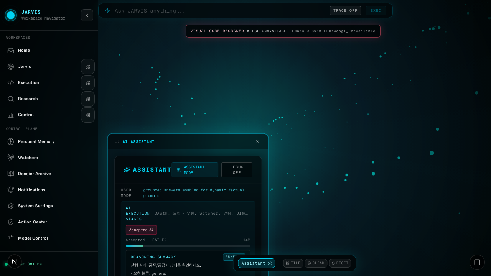
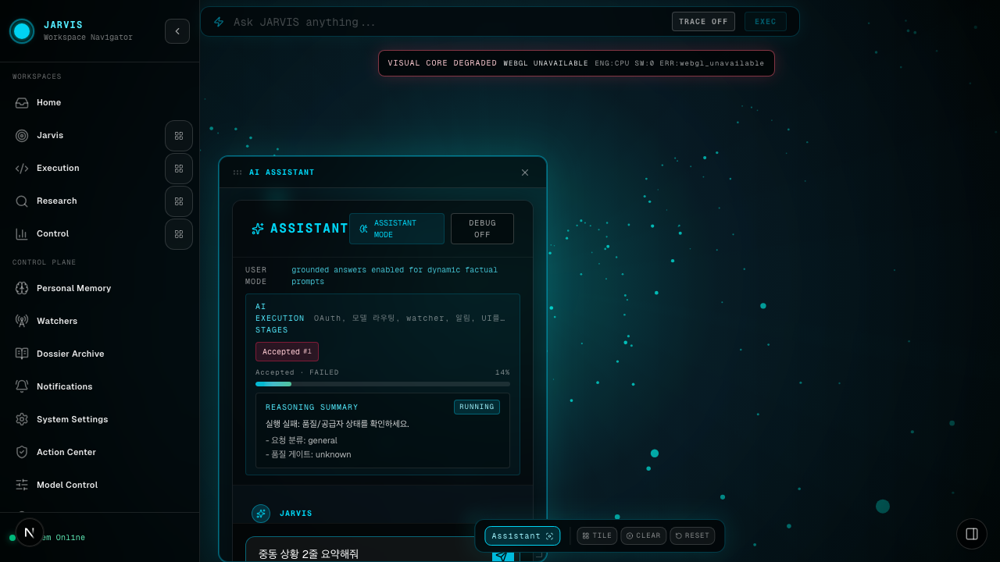
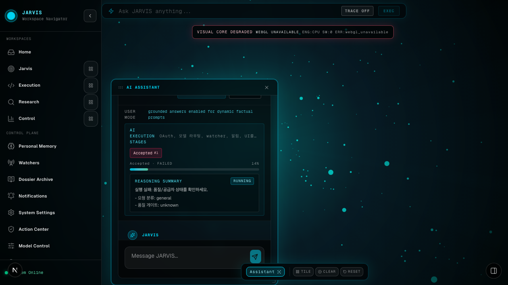
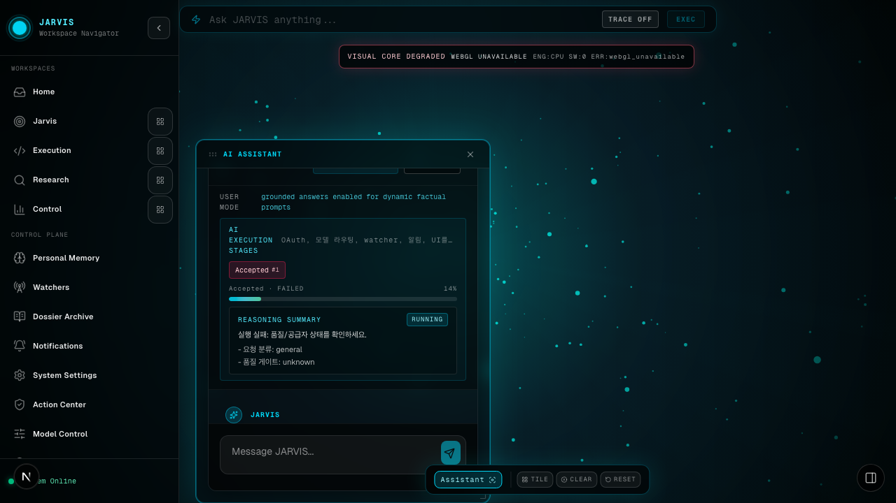

# Dogfood Report: JARVIS

| Field | Value |
|-------|-------|
| **Date** | 2026-03-06 |
| **App URL** | http://127.0.0.1:3000 |
| **Session** | jarvis-phase2-admin / jarvis-phase2-member |
| **Scope** | Phase2 follow-up dogfood on watcher -> dossier, dossier refresh, approval execute, and Assistant completion UX |

## Summary

| Severity | Count |
|----------|-------|
| Critical | 0 |
| High | 0 |
| Medium | 1 |
| Low | 0 |
| **Total** | **1** |

Validated paths with no new issues:
- Watcher creation and manual run from the UI
- Dossier creation after watcher run
- Dossier refresh
- Action Center approve flow

## Issues

### ISSUE-001: Assistant stage panel shows an unrelated stale failed run during a successful new reply

| Field | Value |
|-------|-------|
| **Severity** | medium |
| **Category** | ux |
| **URL** | http://127.0.0.1:3000/?widget=assistant |
| **Repro Video** | videos/issue-001-assistant-stale-stage-repro.webm |
| **Status** | resolved in current worktree after reproduction |

**Description**

When a user sends a new Assistant message and the reply completes successfully, the top `AI EXECUTION STAGES` panel does not switch to the current request. It keeps showing an older failed quick-command run (`OAuth, 모델 라우팅, watcher, 알림, UI를 전면 개편하는 작업을 단계별로 계획하고 승인 전까지 실행은 보류해줘`) while the new reply is rendered below. Expected behavior is that the stage panel either tracks the current request or hides stale session state while a direct Assistant response is active.

**Repro Steps**

1. Open the Assistant widget. The page already shows a stale failed stage entry from a previous request.
   

2. Type a new message such as `중동 상황 2줄 요약해줘` into the Assistant composer.
   

3. Send the message and wait for the new reply to complete.
   

4. **Observe:** the new answer is rendered successfully, but the `AI EXECUTION STAGES` panel still shows the unrelated older failed run instead of the current request.
   

---

## Post-fix Validation

- Patched: [/Users/woody/ai/brain/web/src/components/modules/AssistantModule.tsx](/Users/woody/ai/brain/web/src/components/modules/AssistantModule.tsx)
- Verification screenshot: 
- Result: when there is no active Jarvis session, the stale `AI EXECUTION STAGES` panel is no longer rendered for manual Assistant chat.
