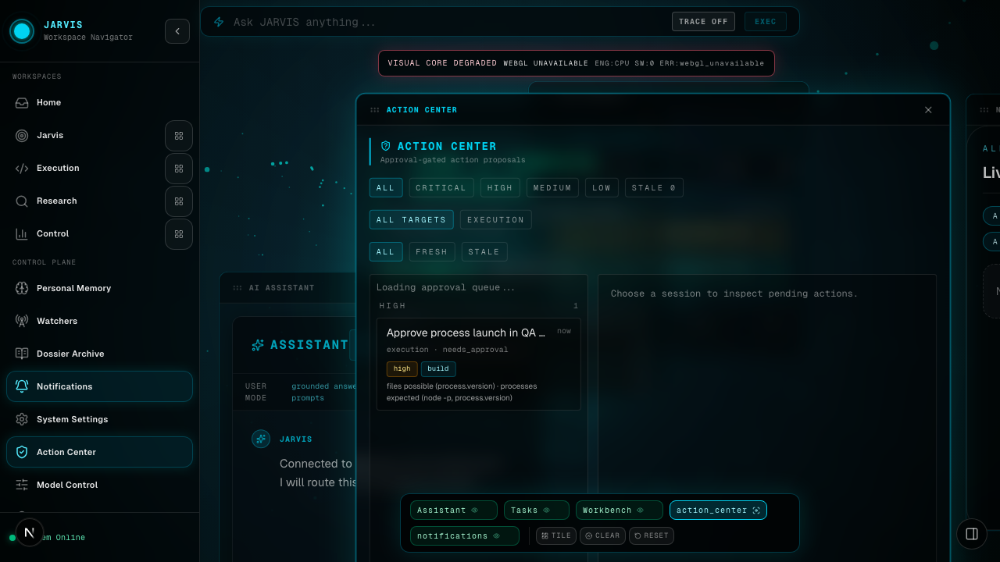
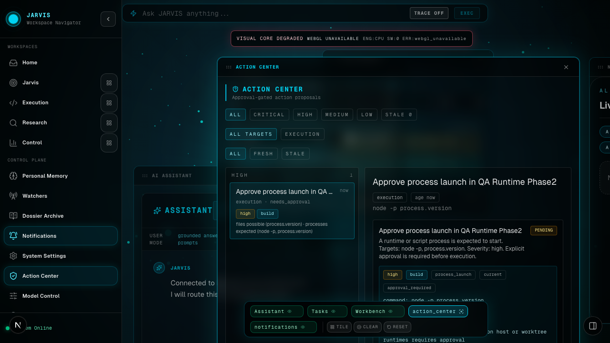
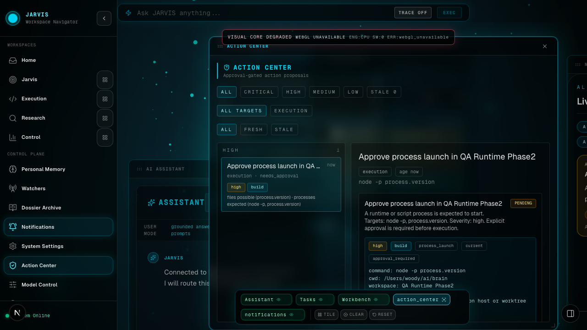
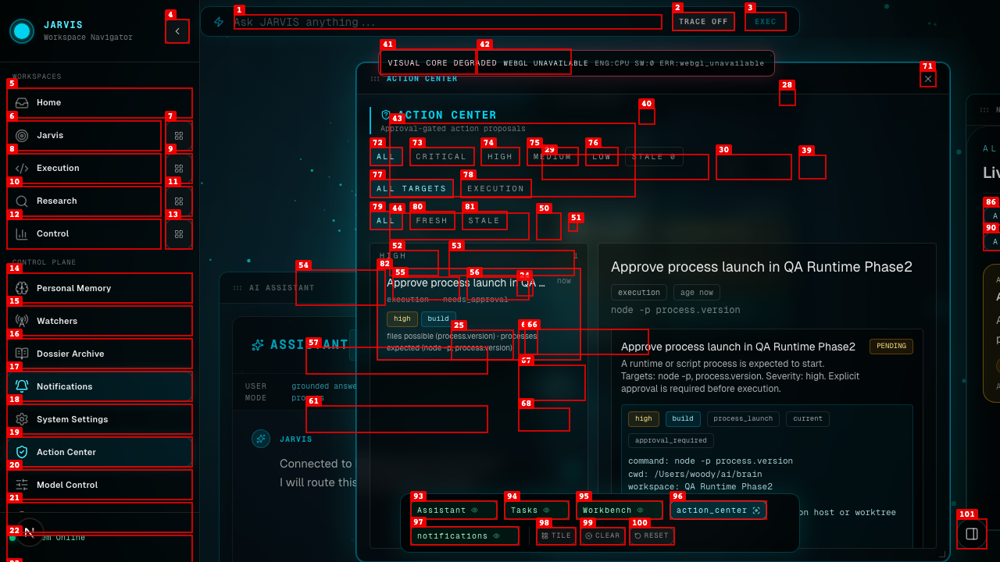

# Dogfood Report: JARVIS HUD Phase 3

| Field | Value |
|-------|-------|
| **Date** | 2026-03-06 |
| **App URL** | http://127.0.0.1:3000 |
| **Session** | jarvis-phase3 |
| **Scope** | Mission / Workbench runtime / approval-gated workspace command |

## Summary

| Severity | Count |
|----------|-------|
| Critical | 0 |
| High | 1 |
| Medium | 0 |
| Low | 0 |
| **Total** | **1** |

## Issues

### ISSUE-001: Approval-required workspace command replays stale transcript and looks already executed

| Field | Value |
|-------|-------|
| **Severity** | high |
| **Category** | functional |
| **URL** | http://127.0.0.1:3000 |
| **Repro Video** | /Users/woody/ai/brain/output/dogfood-20260306-jarvis-phase3/videos/issue-001-workbench-approval-bypass.webm |
| **Status** | resolved |

**Description**

A member user ran a command in Workbench that correctly returned `approval_required`, but the panel kept showing the previous PTY transcript from the same workspace. That made the new command look as if it had already executed before approval. Backend verification showed no new PTY chunks were created; only the old transcript was replayed in the UI. The fix hides existing transcript output when approval is queued and advances the client-side cursor boundary so only post-approval chunks are shown later.

**Repro Steps**

1. Open the Code workspace and select a current runtime that already has prior transcript output.
   

2. Enter a host runtime command that requires approval, such as `node -p process.version`.
   

3. Click `RUN COMMAND`.
   

4. **Observe:** the UI shows `Approval queued`, but the panel also shows the old transcript, which makes the new command look already executed.
   

**Resolution Evidence**

- Fixed file: /Users/woody/ai/brain/web/src/components/modules/WorkbenchModule.tsx
- Regression test: /Users/woody/ai/brain/web/e2e/sidebar-studio-navigation.spec.ts
- Validation screenshot: /Users/woody/ai/brain/output/dogfood-20260306-jarvis-phase3/screenshots/workbench-verify-execution-open.png
